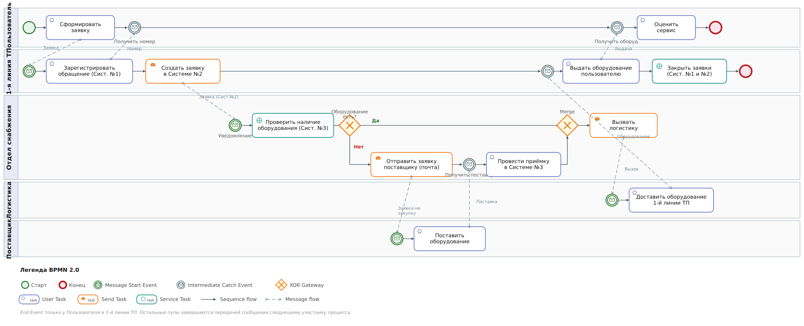

# Решение тестового задания для аналитика (БА+СА)

## Задача 1: BPMN Модель процесса выдачи ИТ-оборудования

### Описание рабочего потока

В компании «X» реализован процесс выдачи ИТ-оборудования пользователям по заявке. Пользователь формирует заявку через почту или по телефону в 1-ую линию технической поддержки, получая номер обращения для отслеживания. 1-я линия ТП, на основании заявки пользователя, создает заявку на оборудование в Системе №2 для отдела снабжения. Отдел снабжения принимает заявку, получая уведомление по почте и видя ее в личном кабинете Системы №2. Далее происходит проверка наличия запрашиваемого оборудования в Системе №3 (складской учет).

- **Если оборудование есть:** Отдел снабжения вызывает логистику, которая доставляет оборудование 1-ой линии ТП. Техническая поддержка выдает оборудование пользователю и закрывает заявки в Системе №1 и Системе №2. Пользователь получает оборудование и может оценить сервис.

- **Если оборудования нет:** Отдел снабжения формирует заявку на закупку поставщику через почту и ожидает поставки. После доставки оборудования поставщиком, снабжение проводит приемку в Системе №3, вызывает логистику для доставки 1-ой линии ТП. Далее процесс аналогичен сценарию с наличием оборудования: ТП выдает оборудование, закрывает заявки, пользователь оценивает сервис.

### BPMN 2.0 Диаграмма процесса

Ниже представлена диаграмма процесса выдачи ИТ-оборудования в нотации, близкой к BPMN 2.0, с использованием PlantUML Activity Diagram.



### Вопросы и противоречия к описанию рабочего потока (для грамотного отражения модели «как есть»)

1. **Отсутствие SLA (Service Level Agreement):** В описании не указаны временные рамки для выполнения каждого этапа процесса (например, время ответа 1-ой линии ТП, время обработки заявки снабжением, сроки доставки логистикой). Это критично для оценки эффективности процесса и управления ожиданиями пользователей.

1. **Ручной ввод данных между системами:** Упоминание о том, что 1-я линия ТП делает заявку в Системе №2 «на основании заявки от пользователя» (из Системы №1 или почты/телефона), а также уведомления для снабжения «из почты» и «на экране своего личного кабинета системы №2», может указывать на ручной перенос данных. Это потенциальный источник ошибок и замедления процесса. Не хватает информации о степени автоматизации интеграции между Системами №1, №2 и №3.

1. **Что если закупка невозможна?** В сценарии, когда оборудования нет, предполагается закупка у поставщика. Однако не описан процесс действий, если поставщик не может предоставить оборудование, или если закупка по каким-либо причинам невозможна/нецелесообразна (например, слишком дорого, устаревшая модель). Должен быть предусмотрен механизм отказа пользователю или предложение альтернатив.

1. **Детализация роли Логистики:** Неясно, является ли Логистика внутренним отделом или внешней службой. Также не описаны детали взаимодействия с ней (например, как происходит вызов, какие данные передаются).

1. **Обратная связь по оценке сервиса:** Пользователь может выставить оценку, но не указано, как эта оценка обрабатывается, кто ее видит и какие действия предпринимаются на ее основе.

1. **Статусы заявки:** Не хватает детализации статусов заявки на разных этапах процесса в каждой из систем. Например, статус "В ожидании поставки", "На согласовании закупки" и т.д.

## Задача 2: Новая функциональность "Публикация товара"

### User Story

**Как продавец**, я хочу **иметь возможность опубликовать свой товар на маркетплейсе**, чтобы **он стал доступен для покупки пользователями**.

### Use Case: Публикация товара в Личном кабинете продавца

#### 1. Название

Публикация товара

#### 2. Действующие лица

**Продавец** (основное), **Система Маркетплейса** (вспомогательное)

#### 3. Предусловия

- Продавец авторизован в Личном кабинете.

- У Продавца есть хотя бы один созданный товар, который еще не опубликован.

- Товар соответствует правилам и требованиям маркетплейса для публикации.

#### 4. Основной поток событий

1. Продавец заходит в раздел "Мои товары" в Личном кабинете.

1. Система отображает список товаров Продавца.

1. Продавец выбирает неопубликованный товар, который он хочет опубликовать.

1. Продавец нажимает кнопку "Опубликовать" (или аналогичную).

1. Система выполняет валидацию данных товара на полноту и соответствие требованиям маркетплейса.

1. Система отправляет товар на модерацию (если требуется).

1. Система отображает сообщение об успешной отправке товара на модерацию/публикацию.

1. После успешной модерации (или если модерация не требуется), Система изменяет статус товара на "Опубликован" и делает его доступным для покупателей на маркетплейсе.

1. Система уведомляет Продавца об успешной публикации товара.

#### 5. Альтернативные потоки

##### 5.1. Товар не прошел валидацию (шаг 5)

5.1.1. Система обнаруживает ошибки или неполные данные в описании товара.5.1.2. Система отображает Продавцу список ошибок и полей, требующих корректировки.5.1.3. Продавец корректирует данные товара и повторяет попытку публикации (возврат к шагу 4).

##### 5.2. Отказ в модерации (после шага 6)

5.2.1. Модератор отклоняет публикацию товара.5.1.2. Система изменяет статус товара на "Отклонен" и уведомляет Продавца о причине отказа.5.1.3. Продавец может внести изменения и повторно отправить товар на модерацию (возврат к шагу 4).

##### 5.3. Отмена публикации (после шага 4)

5.3.1. Продавец решает не публиковать товар и отменяет действие.5.3.2. Система возвращает Продавца к списку товаров без изменения статуса выбранного товара.

#### 6. Пост-условия

- Товар успешно опубликован на маркетплейсе и доступен для покупателей, либо его статус изменен на "На модерации"/"Отклонен" с соответствующим уведомлением Продавца.

- Продавец может просматривать статус товара в Личном кабинете.

### Диаграмма процесса (Activity Diagram)

Ниже представлена диаграмма процесса публикации товара в Личном кабинете продавца.


## Задача 3: Проектирование API и алгоритма регистрации

### Задание 3.1: Описание REST API интерфейса для регистрации Пользователя

На основе предоставленного скриншота интерфейса регистрации и общих практик проектирования API, разработан следующий REST API для регистрации пользователя.

#### Эндпоинт

`POST /api/v1/Account/Register`

#### Описание

Данный эндпоинт предназначен для регистрации нового пользователя в системе. Принимает данные пользователя (имя, фамилия, логин, пароль, токен reCAPTCHA) и возвращает статус регистрации.

#### Входные параметры (Request Body)

| Наименование | Тип | Обязательность | Ограничения |
| --- | --- | --- | --- |
| `firstName` | `string` | Обязательное | Минимальная длина: 2 символа, Максимальная длина: 50 символов. Только буквы. |
| `lastName` | `string` | Обязательное | Минимальная длина: 2 символа, Максимальная длина: 50 символов. Только буквы. |
| `userName` | `string` | Обязательное | Минимальная длина: 3 символа, Максимальная длина: 30 символов. Только латинские буквы, цифры, символы `.` и `_`. Должен быть уникальным. |
| `password` | `string` | Обязательное | Минимальная длина: 8 символов. Должен содержать как минимум одну заглавную букву, одну строчную букву, одну цифру и один специальный символ. |
| `reCaptchaToken` | `string` | Обязательное | Токен, полученный от Google reCAPTCHA. |

#### Выходные параметры при успешном ответе (Status: 201 Created)

| Наименование | Тип | Обязательность | Ограничения |
| --- | --- | --- | --- |
| `userId` | `string` (UUID) | Обязательное | Уникальный идентификатор созданного пользователя. |
| `message` | `string` | Обязательное | Сообщение об успешной регистрации. Пример: "User registered successfully." |

#### Выходные параметры при ответе с ошибкой

##### Описание ошибок и коды ответов

| HTTP Статус | Код ошибки | Описание | Тип ошибки |
| --- | --- | --- | --- |
| `400 Bad Request` | `INVALID_INPUT` | Некорректные входные данные (например, неверный формат полей, несоблюдение ограничений). | Клиентская |
| `400 Bad Request` | `USERNAME_TAKEN` | Пользователь с таким `userName` уже существует. | Клиентская |
| `400 Bad Request` | `WEAK_PASSWORD` | Пароль не соответствует требованиям безопасности. | Клиентская |
| `400 Bad Request` | `RECAPTCHA_FAILED` | Ошибка валидации reCAPTCHA. | Клиентская |
| `500 Internal Server Error` | `SERVER_ERROR` | Внутренняя ошибка сервера. | Серверная |

##### Пример ответа с ошибкой (Status: 400 Bad Request, WEAK_PASSWORD)

```json
{
  "errorCode": "WEAK_PASSWORD",
  "message": "Password must have at least one non-alphanumeric character, one digit ('0'-'9'), one uppercase ('A'-'Z'), one lowercase ('a'-'z') and Password must be eight characters or longer."
}
```

#### Примеры

##### Пример запроса

```json
{
  "firstName": "Ivan",
  "lastName": "Ivanov",
  "userName": "ivan.ivanov",
  "password": "P@ssw0rd1!",
  "reCaptchaToken": "some_recaptcha_token_string"
}
```

##### Пример успешного ответа (Status: 201 Created)

```json
{
  "userId": "a1b2c3d4-e5f6-7890-1234-567890abcdef",
  "message": "User registered successfully."
}
```

##### Пример ответа с ошибкой (Status: 400 Bad Request, USERNAME_TAKEN)

```json
{
  "errorCode": "USERNAME_TAKEN",
  "message": "User with this username already exists."
}
```

### Задание 3.2: Подробный пошаговый алгоритм создания Пользователя на стороне бэк сервиса

Ниже представлен подробный пошаговый алгоритм, описывающий действия бэк-сервиса при получении запроса на создание нового пользователя.


